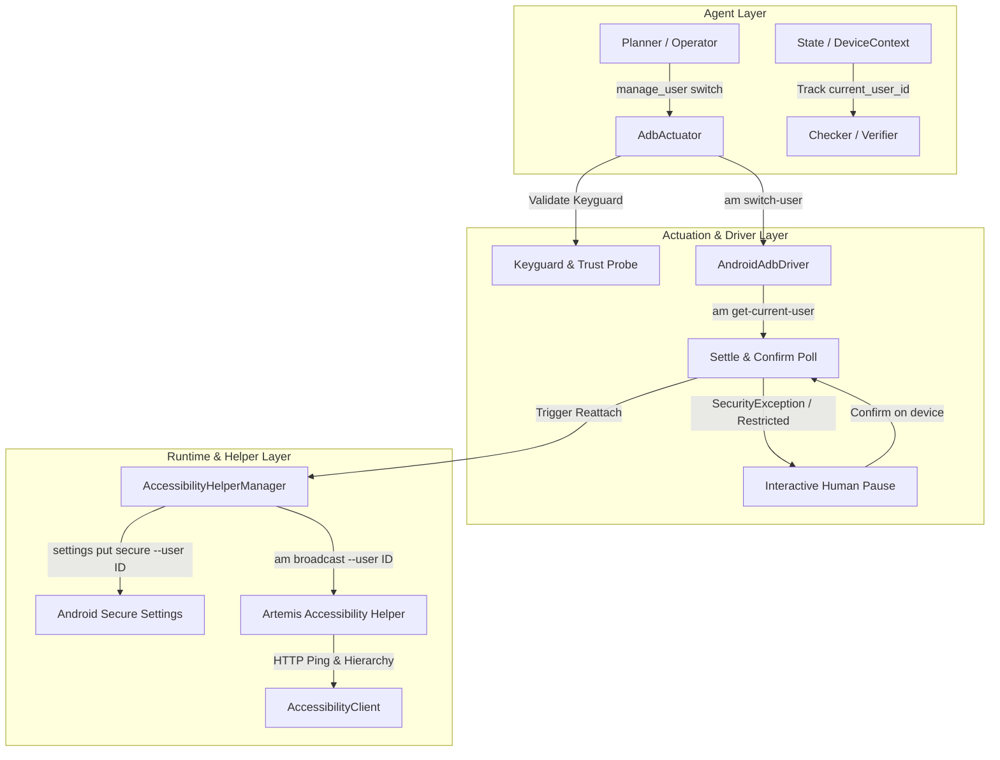

# Autonomous Android Multi-User Switching Architecture Plan

## Executive Summary
This document outlines the end-to-end technical plan for enabling Artemis to autonomously switch between Android device user profiles (e.g., secondary user accounts on shared tablets or multi-user devices) and seamlessly continue task execution within each user profile.

---

## Background & Constraints

Android provides a multi-user subsystem (`android.os.UserManager`) enabling multiple full user profiles on a single hardware device. However, Android enforces strict isolation boundaries across users:

1. **Per-User vs. Device-Global Boundaries**:
   - **Per-User**:
     - Accessibility services: Android runs accessibility services only in the foreground user's context. When a user switch occurs, the previous user's accessibility service is terminated by the OS.
     - Secure settings (`settings get/put secure ...`): Each user maintains its own isolated database of secure settings (e.g., `enabled_accessibility_services`).
     - App processes and tasks: Apps run under isolated Linux UIDs per user (e.g., `u10_a...`).
     - Keyguard / Trust credentials: Lock patterns, PINs, and passwords are user-scoped.
   - **Device-Global**:
     - Physical device transport and port forwarding (`adb forward tcp:...`).
     - Package APK installations (though package enabled/disabled state and user data are per-user).
     - Global settings (`settings get/put global ...`).

2. **Shell Permissions & OEM Variations**:
   - The ADB shell user (`com.android.shell`) holds the `MANAGE_USERS` permission on standard AOSP builds, enabling `am switch-user`, `am get-current-user`, and `pm list users`.
   - OEM builds (e.g., Samsung One UI, Xiaomi HyperOS) may customize multi-user behavior or impose restrictions (`SecurityException`) that require capability detection and interactive recovery.

---

## Resolved Architectural Decisions

1. **Unified Tool Architecture (`manage_user`)**:
   - Adopt a single consolidated tool `manage_user(action: Literal["switch", "list", "current"], user_id: int | None = None)` rather than distinct primitives.
   - Mirrors the existing [`manage_app`](file:///home/bitnom/Code/artemis/artemis/mcp/action_specs.py#L592-L613) pattern (`launch` / `stop`) to minimize LLM token bloat and cognitive friction in agent toolsets.
2. **Guest Account Automation**:
   - Proceed automatically when switching into or out of guest profiles (`FLAG_GUEST`).
   - Emit an informational diagnostic note in step summaries regarding ephemeral storage instead of blocking for human confirmation.
3. **Firmware Restriction Recovery**:
   - When a vendor ROM restricts `am switch-user` with a `SecurityException`, trigger an interactive recovery pause (`ActionCode.BLOCKED`) instructing the human operator to switch profiles manually on the physical device screen.
   - Automatically unblock and resume once `am get-current-user` confirms the switch.

---

## Architectural Changes Overview



The feature requires coordinated changes across six architectural layers:
1. **Runtime & Helper Provisioning** ([`AccessibilityHelperManager`](file:///home/bitnom/Code/artemis/artemis/runtime/helper_manager.py#L263-L1001), [`AccessibilityClient`](file:///home/bitnom/Code/artemis/artemis/clients/accessibility_client.py#L151-L428)): User-scoped secure settings and session lifecycle re-attachment.
2. **Device Driver & Unified Controller** ([`AndroidAdbDriver`](file:///home/bitnom/Code/artemis/artemis/drivers/android/adb_driver.py#L72-L507), [`UnifiedAndroidController`](file:///home/bitnom/Code/artemis/artemis/controllers/unified_controller.py)): Shell commands for user enumeration and switching.
3. **MCP Actions & Manifest** ([`action_specs.py`](file:///home/bitnom/Code/artemis/artemis/mcp/action_specs.py), [`action_manifest.py`](file:///home/bitnom/Code/artemis/artemis/mcp/action_manifest.py), [`AdbActuator`](file:///home/bitnom/Code/artemis/artemis/mcp/actuators/adb.py)): Canonical tool definition and robust execution workflow.
4. **Diagnostic Probes & Keyguard Gate** ([`AdbDeviceProbe`](file:///home/bitnom/Code/artemis/artemis/core/diagnostics/probes/adb_probe.py#L136-L194), [`_ensure_device_unlocked`](file:///home/bitnom/Code/artemis/artemis/sdk/agent.py#L991-L1013)): Per-user lock state parsing to prevent locking out on credential-protected users.
5. **Agent State, Telemetry, & Verification** ([`DeviceContext`](file:///home/bitnom/Code/artemis/artemis/context.py#L75-L95), [`State`](file:///home/bitnom/Code/artemis/artemis/graph/state.py#L34-L75), [`VisualStepSummarizer`](file:///home/bitnom/Code/artemis/artemis/agents/flash/step_summarizer.py)): Tracking active user ID across turns and avoiding false positive verification failures.
6. **Fallback Backend Resilience** ([`UIAutomatorClient`](file:///home/bitnom/Code/artemis/artemis/clients/ui_automator_client.py#L250-L483)): Fallback server lifecycle across user switches.

---

## Phased Implementation Plan

### Phase 1: Driver & Runtime Foundations

#### 1.1 ADB Driver User Primitives
- **Target File**: [`artemis/drivers/android/adb_driver.py`](file:///home/bitnom/Code/artemis/artemis/drivers/android/adb_driver.py)
- **Changes**:
  - Implement data model `AndroidUserInfo(user_id: int, name: str, flags: int, is_running: bool, is_current: bool)`.
  - Add `list_users() -> list[AndroidUserInfo]`:
    - Executes `pm list users` (or fallback to `dumpsys user`).
    - Parses output format `UserInfo{<id>:<name>:<flags>}` and running state flags.
  - Add `get_current_user() -> int`:
    - Executes `am get-current-user` and parses the integer ID.
  - Add `switch_user(user_id: int) -> bool`:
    - Executes `am switch-user <user_id>`.
  - Plumb optional `user_id: int | None = None` into [`execute_shell`](file:///home/bitnom/Code/artemis/artemis/drivers/android/adb_driver.py#L429-L436) and [`launch_app`](file:///home/bitnom/Code/artemis/artemis/drivers/android/adb_driver.py#L385-L392) (`am start --user <user_id>` when specified).

#### 1.2 Multi-User Helper Provisioning & Session Lifecycle
- **Target Files**:
  - [`artemis/runtime/helper_manager.py`](file:///home/bitnom/Code/artemis/artemis/runtime/helper_manager.py)
  - [`artemis/clients/accessibility_client.py`](file:///home/bitnom/Code/artemis/artemis/clients/accessibility_client.py)
- **Changes**:
  - **Per-User Settings**:
    - Update [`_enable_service`](file:///home/bitnom/Code/artemis/artemis/runtime/helper_manager.py#L590-L629) to accept `user_id: int = 0` and pass `--user <user_id>` to `settings get/put secure enabled_accessibility_services` and `settings put secure accessibility_enabled 1`.
    - Update [`is_service_enabled`](file:///home/bitnom/Code/artemis/artemis/runtime/helper_manager.py#L406-L411) to query with `--user <user_id>`.
    - Update [`_revive_service`](file:///home/bitnom/Code/artemis/artemis/runtime/helper_manager.py#L631-L664) with `--user <user_id>`.
  - **Token Broadcast Scoping**:
    - Update [`push_token`](file:///home/bitnom/Code/artemis/artemis/runtime/helper_manager.py#L341-L368) to accept `user_id: int | None = None`. Add `--user <user_id>` to the `am broadcast` command so the token is dispatched directly to the active user's broadcast receiver.
  - **Session Keying & Invalidation**:
    - Update [`HelperSession`](file:///home/bitnom/Code/artemis/artemis/runtime/helper_manager.py#L203-L225) to store `user_id: int`.
    - Key active sessions in `AccessibilityHelperManager` by `(serial, user_id)` or track current active `user_id` on the device.
    - Provide a `switch_session(serial: str, new_user_id: int) -> HelperSession` method that handles dropping the old user's connection, ensuring service readiness in the new user, and reconnecting the HTTP tunnel.

---

### Phase 2: Action Primitives, Manifest, & MCP Actuators

#### 2.1 Unified `manage_user` Tool Specification
- **Target Files**:
  - [`artemis/mcp/action_manifest.py`](file:///home/bitnom/Code/artemis/artemis/mcp/action_manifest.py)
  - [`artemis/mcp/action_specs.py`](file:///home/bitnom/Code/artemis/artemis/mcp/action_specs.py)
  - [`artemis/mcp/actuators/base.py`](file:///home/bitnom/Code/artemis/artemis/mcp/actuators/base.py)
  - [`artemis/mcp/actuators/adb.py`](file:///home/bitnom/Code/artemis/artemis/mcp/actuators/adb.py)
- **Changes**:
  - Add `manage_user` to `OPTIONAL_ACTIONS` in `action_manifest.py`.
  - Define `ActionSpec` for `manage_user`:
    - **Operator Dialect**:
      - `action: Literal["switch", "list", "current"]`
      - `user_id: int | None` (required when `action == "switch"`)
    - **Wire Dialect**:
      - `action: str`, `user_id: int | None`
  - Implement handler in `Actuator` and `AdbActuator`.

#### 2.2 Switch Execution Flow & Guard Rails
- In `AdbActuator.manage_user`:
  1. **Action "list"**:
     - Call `driver.list_users()`. Format user table showing ID, name, running status, and whether each account is an admin, secondary, or guest user.
  2. **Action "current"**:
     - Call `driver.get_current_user()` and return active profile metadata.
  3. **Action "switch"**:
     - **Validation**: Query `list_users()`. Verify `user_id` is supplied and exists. Reject managed work profiles (`is_profile=True`) with explanatory error.
     - **Guest Handling**: If target or current account has `FLAG_GUEST`, proceed automatically while adding an informational diagnostic line to the step summary regarding ephemeral storage.
     - **Keyguard Check**: Query target user's lock status before switching (see Phase 3). If target user has a secure keyguard (PIN/pattern/password), return `ActionResult.failure("Target user <id> is locked with secure credentials. Unlock manually.", code=ActionCode.BLOCKED)`.
     - **Switch & Polling**:
       - Execute `am switch-user <user_id>`.
       - If `SecurityException` / restricted permission occurs: return recoverable blocked action: `"Firmware restricted automated user switching. Please switch to User <id> manually on the device to continue."`
       - Poll `am get-current-user` until foreground user matches target (bounded retry loop).
     - **Helper Re-Attachment**:
       - Call `helper_manager.attach(serial, user_id=user_id, provision=True)`.
       - Wait for loopback ping and verify screen accessibility hierarchy dump.
     - **Context Synchronization**:
       - Update active `current_user_id` on context and state.

---

### Phase 3: Diagnostic Probes & Keyguard Gating

#### 3.1 Per-User Lock Parsing
- **Target Files**:
  - [`artemis/core/diagnostics/probes/adb_probe.py`](file:///home/bitnom/Code/artemis/artemis/core/diagnostics/probes/adb_probe.py)
  - [`artemis/sdk/agent.py`](file:///home/bitnom/Code/artemis/artemis/sdk/agent.py)
- **Changes**:
  - In `dumpsys trust`, parse per-user trust blocks:
    ```text
    User "0": ... deviceLocked=false
    User "10": ... deviceLocked=true
    ```
  - Update [`_parse_device_lock_state`](file:///home/bitnom/Code/artemis/artemis/core/diagnostics/probes/adb_probe.py#L136-L194) and [`_ensure_device_unlocked`](file:///home/bitnom/Code/artemis/artemis/sdk/agent.py#L991-L1013) to accept target `user_id: int = 0`.
  - Match regex against the block corresponding specifically to `User "<user_id>"`.

#### 3.2 Blocked Action Integration
- Return structured `ActionCode.BLOCKED` when target user has an active PIN/password/pattern.
- Connects into the Pro Exploration and Operator recovery loops so human intervention is requested cleanly without aborting the task context.

---

### Phase 4: Agent Loop, Context, & State Telemetry

#### 4.1 State & Context Models
- **Target Files**:
  - [`artemis/context.py`](file:///home/bitnom/Code/artemis/artemis/context.py)
  - [`artemis/graph/state.py`](file:///home/bitnom/Code/artemis/artemis/graph/state.py)
  - [`artemis/graph/visibility.py`](file:///home/bitnom/Code/artemis/artemis/graph/visibility.py)
- **Changes**:
  - Add `current_user_id: int = 0` to [`DeviceContext`](file:///home/bitnom/Code/artemis/artemis/context.py#L75-L95).
  - Add `current_user_id: Annotated[int, "Active Android user profile ID", take_last] = 0` to [`State`](file:///home/bitnom/Code/artemis/artemis/graph/state.py#L34-L75).
  - Update `NODE_VISIBILITY` in `visibility.py` to allow agent nodes to read `current_user_id`.

#### 4.2 Step Telemetry & Visual Summarizer
- **Target Files**:
  - [`artemis/agents/flash/runner.py`](file:///home/bitnom/Code/artemis/artemis/agents/flash/runner.py)
  - [`artemis/agents/flash/step_summarizer.py`](file:///home/bitnom/Code/artemis/artemis/agents/flash/step_summarizer.py)
- **Changes**:
  - Record `user_id` in DataEngine step metadata and step summaries.
  - Add visual transition formatting for `manage_user`: e.g., `"Switched device user to profile '{user_name}' (ID {user_id})"`.

#### 4.3 Checker & Verifier Boundaries
- **Target Files**:
  - [`artemis/agents/checker/checker.py`](file:///home/bitnom/Code/artemis/artemis/agents/checker/checker.py)
  - [`artemis/graph/checkpoints.py`](file:///home/bitnom/Code/artemis/artemis/graph/checkpoints.py)
- **Changes**:
  - Mark user switch actions as explicit context reset boundaries so visual changes (wallpapers, launch screens, app lists) are interpreted as expected transitions rather than unintended UI discrepancies.

---

### Phase 5: UIAutomator Fallback & Environmental Resilience

#### 5.1 Fallback Backend Lifecycle
- **Target Files**:
  - [`artemis/clients/ui_automator_client.py`](file:///home/bitnom/Code/artemis/artemis/clients/ui_automator_client.py)
  - [`artemis/clients/screen_client_factory.py`](file:///home/bitnom/Code/artemis/artemis/clients/screen_client_factory.py)
- **Changes**:
  - Restart/re-init `UIAutomatorClient` instrumentation server across user switches when running in fallback mode (`auto` or `uiautomator`).

#### 5.2 OEM Restriction & Human Pause
- Intercept `SecurityException` from `am switch-user`.
- Emit human intervention pause prompting manual user switch on the physical screen, followed by confirmation polling.

---

### Phase 6: Testing & Quality Assurance

#### 6.1 Unit Testing
- Mock ADB runner tests for `manage_user` (`list`, `current`, `switch`).
- Test `AccessibilityHelperManager` per-user settings command generation: verify `--user <id>` parameters are emitted accurately.
- Test lock parsing regex against dumps from Android 11, 12, 13, 14, and 15 devices with multiple users.
- Test `ActionSpec` schema and validator compliance for `manage_user`.

#### 6.2 Integration Testing
- Real device / emulator multi-user test harness:
  - Create secondary user via `pm create-user TestUser`.
  - Exercise full switch flow: User 0 -> TestUser -> User 0.
  - Verify accessibility helper attaches and returns UI hierarchy dumps in both accounts.
  - Clean up test user in test teardown (`pm remove-user <id>`).

---

## Boundaries & Scope

| In-Scope | Out-of-Scope (Future Iterations) |
|---|---|
| Full secondary user profiles (`FLAG_FULL`, `FLAG_ADMIN`, standard users) | Managed Work Profiles (`FLAG_MANAGED_PROFILE`) - run concurrently, require profile-specific intent routing rather than switching |
| Consolidated `manage_user` tool (`switch`, `list`, `current`) | Creating or deleting Android users programmatically via the agent |
| Automatic guest profile transitions with diagnostic warnings | Bypassing or guessing secure keyguard PIN/password/pattern |
| Interactive pause on restricted OEM firmware builds | Multi-device orchestration (already supported separately) |
